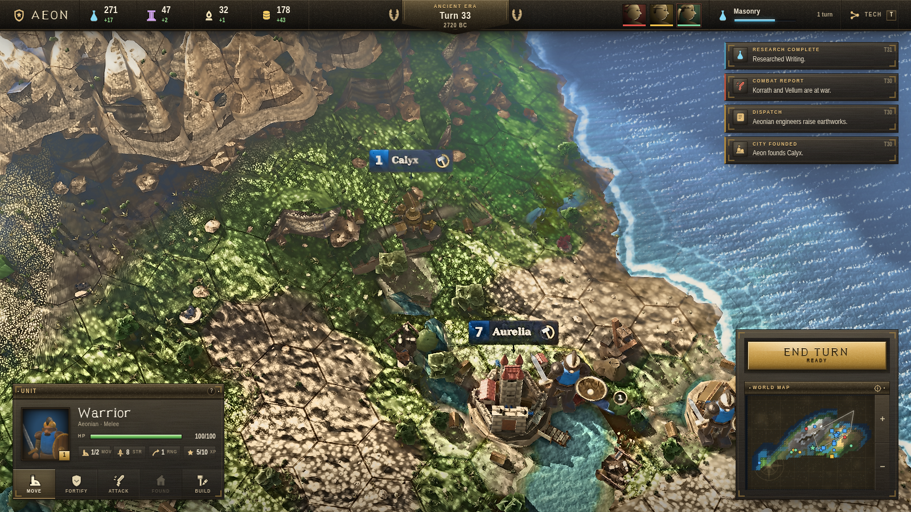

# AEON

A Civilization-style turn-based 4X strategy game that runs in the browser. Three.js, no game engine,
no external art: every texture, mesh, shader and icon is generated in code at load time.

**[Play it](https://qmw.github.io/aeon/)** · MIT licensed



## What's in it

**World.** Procedural generation with tectonic plates, orogenic uplift producing connected mountain
ranges, latitude/altitude climate with prevailing-wind moisture transport and rain shadows, hydraulic
erosion, and a drainage network solved by flow accumulation — rivers run mountain-to-sea along hex
edges, merge at confluences, and widen downstream. Biomes follow from temperature and moisture rather
than being painted on. Deterministic from a seed; a 64×44 map generates in about 30 ms.

**Game.** Hex grid with A* pathfinding over terrain movement costs, cities that work tiles and grow,
production queues, buildings and districts, culture-driven border expansion, a 32-tech tree across
four eras, ranged and melee combat with terrain and flanking modifiers, promotions, embarkation,
per-civ fog of war, and AI opponents that explore, settle, expand, research, declare war and make
peace — using their own fog state, without omniscience.

**Rendering.** Merged-geometry hex terrain with procedural biome splatting and instanced vegetation,
atmospheric scattering sky with drifting cloud shadows, a water shader with depth-ramped colour,
fresnel reflection, shore foam and river channels, cascaded shadow maps with a fitted frustum, and a
post chain doing GTAO, bloom, TAA and filmic grading.

## Run it

```bash
npm install
npm run dev      # http://localhost:5173
npm run build    # static bundle in dist/
npm test         # 260-turn headless simulation
```

`npm test` plays a full match with no renderer and asserts the invariants — no NaN yields, techs
unlock in prerequisite order, paths never cross impassable terrain, AI never reads through fog.

## Controls

WASD or edge-scroll to pan · wheel to zoom · Q/E to rotate · click to select · Space to end turn ·
Escape to deselect · T for the tech tree

## How it was built

Written by Claude Code as an experiment in multi-agent development: subsystem agents building in
parallel against a fixed module contract, each judged by a separate art-director agent comparing the
rendered frame against shipping Civilization VI screenshots, looping until the critic stopped
rejecting.

Two things turned out to matter more than the fan-out:

- **Objective gates beat opinions.** `tools/metrics.mjs` measures per-region detail energy, blob
  energy, hue, saturation and clipping on a screenshot. An early one-sided target ("detail energy
  ≥ 12") was promptly satisfied by spraying per-pixel noise, so the gate now bounds detail on both
  sides and requires it to shrink with distance — a property screen-space noise cannot fake.
- **Accept/revert beats stacking.** Parallel agents each improved their own subsystem while
  collectively degrading the frame, oscillating for six passes. Switching to sequential single-owner
  passes, with a referee scoring the whole frame and `git` reverting anything that lowered it,
  produced the only monotonic gain.

`tools/shot.mjs` screenshots the running game headlessly and waits on rendered-frame count rather
than wall-clock — under software WebGL a timed wait captures an unconverged TAA frame, which
generated a long run of bogus "the near field is blurry" critiques before anyone noticed.

`docs/ART-BIBLE.md` holds the locked art direction, `docs/CONTRACT.md` the module interfaces, and
`docs/CRITIQUE-phase*.md` every critic report, unedited.

## Status

The **game** is done: a full match plays start to finish, the 260-turn headless simulation passes
every invariant, and `npx vite build` ships a static bundle.

The **renderer** is closer than it was and still not there — but it moved this phase, after nine
straight attempts that could not land anything. The reason was the gate.

### Scoring is retired; the gate is a tournament

For ten phases a referee agent scored the frame 0–100 against a real Civilization VI screenshot on
six axes, and a change was kept if the number went up. The problem was noise — about a point per
axis and about three on the total, which is the size of a real improvement. Twice the score gate
threw away the best frame the project had ever rendered and both had to be restored by hand
(`14fb0ff`, `6a17231`); three consecutive phases then reverted nine attempts out of nine.

Every attempt is now put **side by side against the reigning champion frame** and shown to two
independent judges, with the labels in opposite order so position cannot bias them. It is kept only
if **both** judges pick the challenger. Nobody is asked for a number — they are asked the only
question this project is actually judged on: which of these two is better.

One phase of evidence, so read it as a signal rather than a proof:

| pass | outcome |
|---|---|
| terrain — rock gets its mineral chroma back | accepted |
| water — a pixel band the sea can keep, glitter back in its lobe, the river's gravel slab becomes a wet margin | accepted |
| massif — one closed summit mass per hex, real instance normals, snow off the tonemap shoulder | accepted, and **promoted to champion** |
| units — helmet, sword, shield, idle facing | **lost, reverted whole** (`74ecef7`) |

Three of four passes landed, against nine straight failures under the score gate on the same
defects. The objective gate agrees the frame moved: `tools/metrics.mjs` on the released hero frame
went from **seven failures to three**.

| check | phase 10 | now |
|---|---|---|
| near/far detail ramp (≥ 1.6) | 1.54 ✗ | **1.63 ✓** |
| water HF_rms (7–15) | 3.52 ✗ | **9.09 ✓** |
| water MID/HF (0.9–1.3) | 3.92 ✗ | **1.19 ✓** |
| near-sand saturation (≤ 0.46) | 0.467 ✗ | **0.436 ✓** |
| mid-sand HF_rms (≤ 22) | 23.69 ✗ | 23.70 ✗ |
| near-sand HF_rms (≤ 22) | 22.61 ✗ | 22.98 ✗ |
| near-sand MID/HF (≤ 1.3) | 1.36 ✗ | 1.36 ✗ |

0.08 of the frame crushed, 0.00 blown — the ends of the histogram stay clean.

The catch is the one a paired comparison is supposed to have: it punishes a change that improves one
thing while visibly costing another, which is most changes. The unit pass was reverted whole for
exactly that.

### What is still weakest

Judge verdicts are not archived — only the accept/revert decision reaches git — so this is the
outstanding list as the champion frame and the objective gate show it, with the pass that lost the
last comparison at the top. `shots/final-hero.png` **is** the champion frame; it is what the next
challenger has to beat.

1. **Units are giants with no arms.** The one pass since the champion was crowned was a units pass,
   and it lost. In `final-close.png` the garrison soldier stands as tall as Aurelia's keep tower,
   and his sword and shield hang at his sides with no arm reaching either one; in `final-wide.png`
   a single soldier is the height of the walled town beside him. Back at the distance the hero
   frame is played at, the same figure collapses to a strength badge and a contact ring over a
   mound — too big to be a man, too vague to be a warrior.
2. **The near field is confetti over blobs.** All three surviving gate failures are in the two sand
   boxes nearest the camera: HF 23.7 and 23.0 against a 22 ceiling, MID/HF 1.36 against 1.3. The
   distance falloff is fixed — the ramp passes at 1.63 for the first time in the project — but near
   ground still reads as leopard-spot mottling at cloud-shadow scale with pixel fizz on top,
   instead of grain at a nameable world size.
3. **Mountains are the right shape on the wrong rock.** The massif pass gave them a closed summit
   mass per hex, correct instance normals and a hex seam that survives on rock — all new, all real
   gains. They now read as tan sandstone wedges: the far-rock box measures saturation 0.29 at hue
   33° against the locked mountain `#7A7368` (sat 0.08–0.18), shard edges stay hard, and the snow
   caps are flat paper-white triangles rather than lit volume.
4. **Per-biome palette compliance.** Whole-frame saturation now sits inside the metrics band, but
   the bible is written per biome and sand at 0.43 is still well over desert's 0.24–0.34. Open
   ocean at mean 129 is nearer coast brightness than the specified `#123A63`.
5. **Rivers.** The translucent slab is thinner and the bank is a wet margin now, but the channel is
   still a chain of flat angular plates laid along the hex edges rather than a bed cut into the
   terrain, and it takes no sun.
6. **The hex seam on rock is present but faint.** Non-negotiable #1 is no longer outright broken
   across the mountain band, which is new — but the line there is far weaker than on grass and it
   loses wherever the rock goes bright.

No one has yet put this frame beside a real Civ VI screenshot under the tournament rules; the last
time that comparison was run, the judge picked the real one immediately. The measurements, the per-phase record and
the gate designs that ratcheted versus the ones that stalled are in `docs/RESUME.md` — that record
may still be the most useful thing in this repo.

Contributions welcome — `docs/ART-BIBLE.md` (the locked direction) and `tools/metrics.mjs` (the
objective gate) are the two things to read first.
