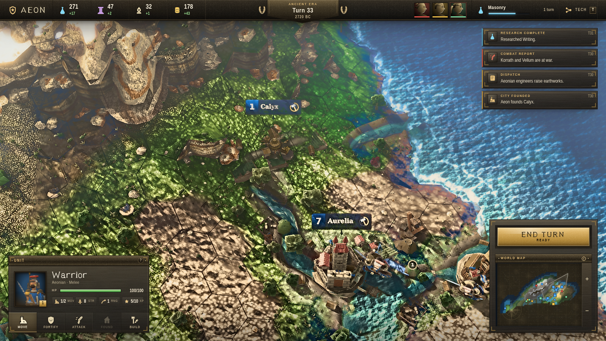

# AEON

A Civilization-style turn-based 4X strategy game that runs in the browser. Three.js, no game engine,
no external art: every texture, mesh, shader and icon is generated in code at load time.

**[Play it](https://qmw.github.io/aeon/)** · MIT licensed



## What's in it

**World.** Procedural generation with tectonic plates, orogenic uplift producing connected mountain
ranges, latitude/altitude climate with prevailing-wind moisture transport and rain shadows, hydraulic
erosion, and a drainage network solved by flow accumulation — rivers run mountain-to-sea along hex
edges, merge at confluences, and widen downstream. Biomes follow from temperature and moisture rather
than being painted on. Deterministic from a seed; a 64×44 map generates in about 30 ms.

**Game.** Hex grid with A* pathfinding over terrain movement costs, cities that work tiles and grow,
production queues, buildings and districts, culture-driven border expansion, a 32-tech tree across
four eras, ranged and melee combat with terrain and flanking modifiers, promotions, embarkation,
per-civ fog of war, and AI opponents that explore, settle, expand, research, declare war and make
peace — using their own fog state, without omniscience.

**Rendering.** Merged-geometry hex terrain with procedural biome splatting and instanced vegetation,
atmospheric scattering sky with drifting cloud shadows, a water shader with depth-ramped colour,
fresnel reflection, shore foam and river channels, cascaded shadow maps with a fitted frustum, and a
post chain doing GTAO, bloom, TAA and filmic grading.

## Run it

```bash
npm install
npm run dev      # http://localhost:5173
npm run build    # static bundle in dist/
npm test         # 260-turn headless simulation
```

`npm test` plays a full match with no renderer and asserts the invariants — no NaN yields, techs
unlock in prerequisite order, paths never cross impassable terrain, AI never reads through fog.

## Controls

WASD or edge-scroll to pan · wheel to zoom · Q/E to rotate · click to select · Space to end turn ·
Escape to deselect · T for the tech tree

## How it was built

Written by Claude Code as an experiment in multi-agent development: subsystem agents building in
parallel against a fixed module contract, each judged by a separate art-director agent comparing the
rendered frame against shipping Civilization VI screenshots, looping until the critic stopped
rejecting.

Two things turned out to matter more than the fan-out:

- **Objective gates beat opinions.** `tools/metrics.mjs` measures per-region detail energy, blob
  energy, hue, saturation and clipping on a screenshot. An early one-sided target ("detail energy
  ≥ 12") was promptly satisfied by spraying per-pixel noise, so the gate now bounds detail on both
  sides and requires it to shrink with distance — a property screen-space noise cannot fake.
- **Accept/revert beats stacking.** Parallel agents each improved their own subsystem while
  collectively degrading the frame, oscillating for six passes. Switching to sequential single-owner
  passes, with a referee scoring the whole frame and `git` reverting anything that lowered it,
  produced the only monotonic gain.

`tools/shot.mjs` screenshots the running game headlessly and waits on rendered-frame count rather
than wall-clock — under software WebGL a timed wait captures an unconverged TAA frame, which
generated a long run of bogus "the near field is blurry" critiques before anyone noticed.

`docs/ART-BIBLE.md` holds the locked art direction, `docs/CONTRACT.md` the module interfaces, and
`docs/CRITIQUE-phase*.md` every critic report, unedited.

## Status

Playable and complete as a game loop; the renderer is still short of its target. Blind judging still
picks real Civilization VI, and the outstanding defects are listed in `docs/RESUME.md`. Contributions
welcome — the art bible and the metric gate are the two things to read first.
